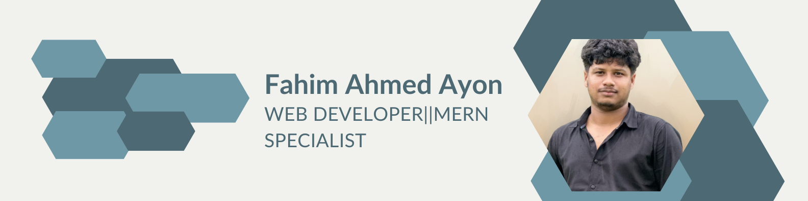

  

# 👋 Hi, I'm Fahim Ahmed  

🚀 **MERN Stack Developer** | Passionate about building modern web applications  

---

## 🧑‍💻 About Me
- 🌱 MERN Stack Developer  
- 💻 Love working with **React, Next.js & Node.js**
- ⚡ Strong foundation in **C, C++, Java, JavaScript**
- 🎯 Focused on clean code & scalable applications

---

## 🛠️ Tech Stack

### 🚀 Frontend

  
  
  
  
  
  

---

### ⚙️ Backend

  
  

---

### 💾 Programming Languages

  
  
  
  

---

### 🗄️ Database

  

---

## 📊 GitHub Stats

  
  

---

## 📫 Connect With Me

  
  

---

⭐ **If you like my work, consider giving a star!**
